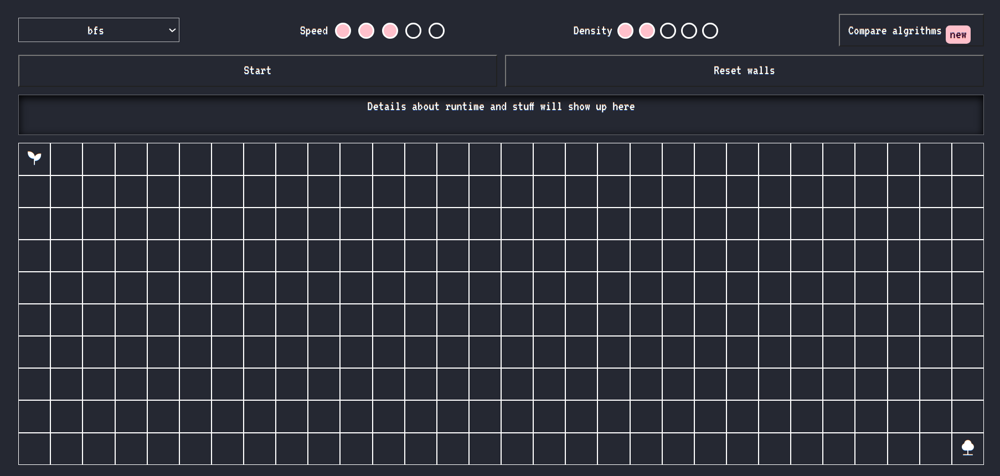
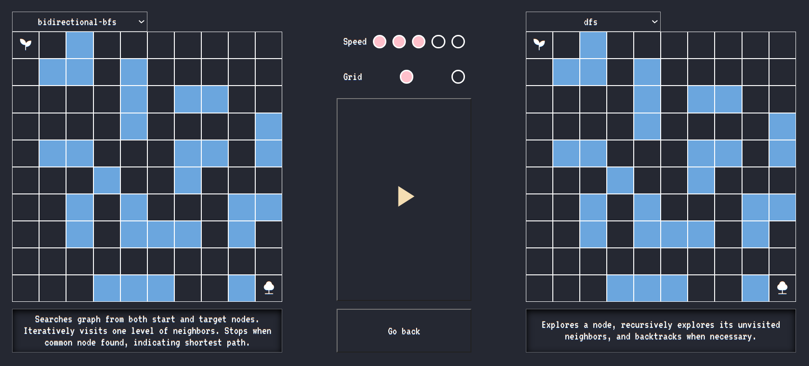

[Go to website](https://amuwal.github.io/algorithm-visualiser/)

# Pathfinding Algorithm Visualizer 
This project is a pathfinding algorithm visualizer that allows you to visualize various algorithms such as Breadth-First Search (BFS), Depth-First Search (DFS), and more. It also includes a feature to visualize algorithm size side by side for comparison. The visualizer provides interactive functionality such as changing the start and target nodes by dragging them, creating walls on the grid, adjusting the visualization speed, and grid density. 

## Table of Contents
- [Supported Algorithms](#supported-algorithms)
- [Interactive Features](#interactive-features)

## Supported Algorithms

 The visualizer currently supports the following algorithms:

* Breadth-First Search (BFS)

* Depth-First Search (DFS)

* Bidirectional BFS

## Interactive Features

**Dragging Start and Target Nodes**

To change the start and target nodes, simply click and drag them to your desired locations on the grid. This allows you to dynamically set the starting point and the goal for the pathfinding algorithms.

**Creating Walls**

To create walls on the grid, click on any empty cell. This will toggle the cell between being a wall or empty. Walls are obstacles that the pathfinding algorithms must navigate around.

**Comparing Algorithms Side by Side**

The visualizer also includes a feature to compare algorithm sizes side by side. This allows you to visually compare the exploration patterns and paths generated by different algorithms simultaneously, providing insights into their behaviors and efficiencies.

**Adjusting Visualization Speed**

You can adjust the speed of the visualization to control how fast the algorithms are displayed. Use the speed control slider to increase or decrease the visualization speed according to your preference.

**Adjusting Grid Density**

The grid density determines the number of cells in the grid. You can increase or decrease the density using the density control slider. Higher density allows for more precise control over the grid, while lower density provides a broader view of the algorithm's progress.
